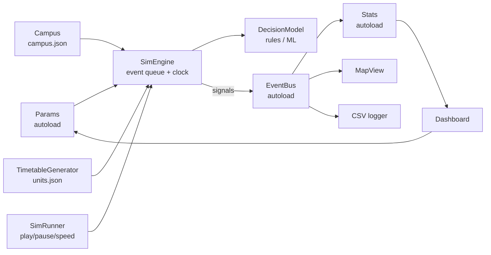
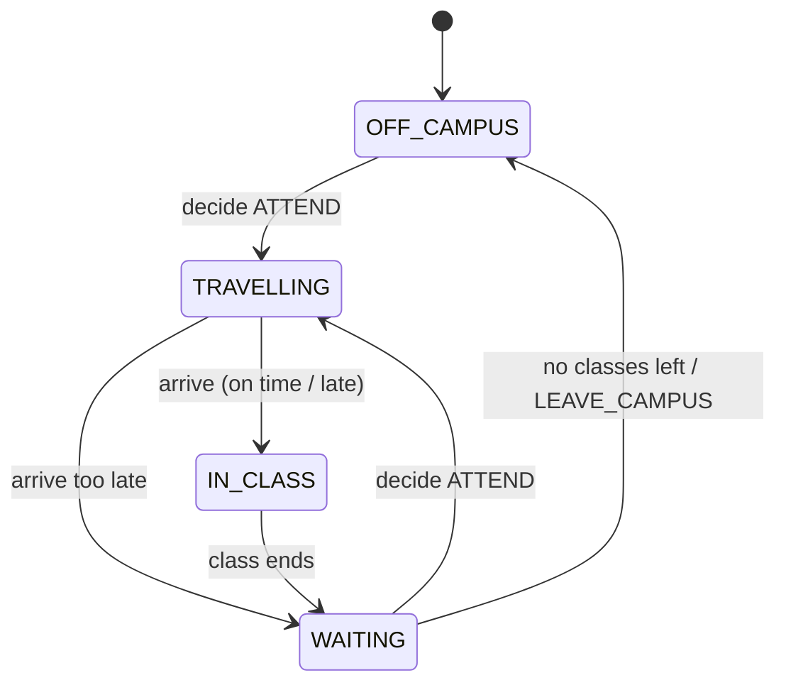

# Architecture

University Simulator 2026 is a **discrete-event simulation**. Nothing moves on a fixed tick. Instead, a queue of timed events (a class starts, a student decides, a student arrives) moves the clock forward. The visuals watch the simulation, but they never drive it.

## Layers



| Layer | Files | Depends on | Must not depend on |
| --- | --- | --- | --- |
| Config | `autoload/Params.gd` | nothing | anything else |
| Core simulation | `sim/*.gd`, `decisions/*.gd` | Params, EventBus | Nodes, scenes, UI |
| Signals | `autoload/EventBus.gd` | core types | UI |
| Aggregation | `autoload/Stats.gd`, loggers | EventBus | UI |
| Real-time driver | `sim/SimRunner.gd` | SimEngine, Params | UI |
| Presentation | `scenes/`, `ui/` | EventBus, Stats, Params, SimRunner | SimEngine internals |

**Why this matters:** the core runs with no window. That lets us run unit tests, run 5,000 students at full speed to log training data, and replace the visuals later without touching the rules.

## Time

- Time is a `float` in **minutes from Monday 00:00** of the simulated week. `SimTime` converts it (`SimTime.at(1, 9, 30)` = Tue 09:30 = `2010.0`).
- Time is continuous: a student can arrive at 10:07.5.
- A run covers `Params.days_to_simulate` days and ends at midnight after the last one.

## Event queue

`EventQueue` is a binary min-heap ordered by `(time, seq)`. `seq` is the order events were scheduled in. That makes ties deterministic, so the same seed always gives the same run.

| Event | Subject | What happens |
| --- | --- | --- |
| `DAY_START` | day | Each student schedules a decision for their first class that day |
| `CLASS_START` | session | Signal only (UI, stats) |
| `CLASS_END` | session | Everyone inside becomes WAITING and schedules their next decision |
| `STUDENT_DECIDE` | student | The decision model picks an action; ATTEND leaves right away |
| `STUDENT_ARRIVE` | student | The student is on time, late, or too late to enter |

## Student flow



### The core rules (SimEngine)

1. **When to decide.** For the next class, `decide_at = max(now, class.start − travel − arrival_buffer)`. Students aim to arrive `arrival_buffer_minutes` early.
2. **Travel.** `travel = campus.travel_minutes(from, to)` = shortest-path distance ÷ walking speed (× crowding later). If `decide_at` is already past, the student leaves now. **This is how back-to-back classes in far-apart buildings cause lateness.**
3. **On arrival.** `minutes_late = max(0, arrive − start)`.
   - `minutes_late > skip_threshold_minutes` → too late: counts as a skip (`too_late`).
   - `minutes_late > late_grace_minutes` → attended but late.
   - otherwise → attended on time.
4. **Decisions** decide *what* (attend, skip, leave campus). The engine decides *when* and *how long*.
5. **Going home.** When a student has no classes left today, they go to the entrance and become OFF_CAMPUS.

## Decision models

```gdscript
class_name DecisionModel
enum Action { ATTEND_NEXT, SKIP_NEXT, LEAVE_CAMPUS }
func decide(student: Student, context: DecisionContext, rng: RandomNumberGenerator) -> Action
```

- `DecisionModel` (base) = always attend. It's the baseline for tests and experiments.
- `RuleDecision` (Sprint 3) = hand-set probabilities based on motivation, tiredness, expected lateness and time of day. Every probability is a named constant or a Params value, with its source noted in a comment.
- `MLDecision` (Semester 2) loads a model from JSON (see DATA_FORMATS.md) and runs it in GDScript.
- Models must use the `rng` they are given for all randomness. Never use `randf()` or `randi()`.
- `DecisionContext.to_features()` is the feature vector. The same dictionary is emitted on `EventBus.student_decided` for logging, so training data and runtime features always match.

## Signals (EventBus)

The engine emits these signals and never calls UI code. See `autoload/EventBus.gd` for signatures.

`run_started`, `run_finished`, `sim_time_changed`, `day_started`, `class_started`, `class_ended`, `student_state_changed`, `student_departed`, `student_arrived`, `student_attended`, `student_skipped`, `student_decided`.

Adding a signal: add it to EventBus with typed arguments and a `##` comment, emit it from the engine, and list it here.

## Parameters

`Params` holds every adjustable value as a typed variable, plus a `SPECS` entry (min, max, step, label, group). The parameter panel should be built from `SPECS`, so a new parameter shows up in the UI automatically. Values are read at the start of each run: the user changes values and presses Reset.

## Performance targets

- 5,000 students × 5 days runs to the end in a few seconds headless.
- Draw students with one `MultiMeshInstance2D`, not one Node per student.
- `Campus` pre-computes all building-to-building distances once (Dijkstra from each building) so `travel_minutes` is a lookup.
- The dashboard refreshes on `sim_time_changed` (once per frame), not per event.

## Components still to build

| Component | File | Contract |
| --- | --- | --- |
| Campus loader + pathfinding | `sim/Campus.gd` | Implement the stubbed methods; keep the public API |
| Timetable generator | `sim/TimetableGenerator.gd` | `generate(campus: Campus, rng: RandomNumberGenerator) -> {"sessions": Array[ClassSession], "students": Array[Student]}` using Params. No room double-booking; no student clashes; respects day start/end and slot gap |
| Rule decisions | `decisions/RuleDecision.gd` | Extends DecisionModel |
| Map view | `scenes/MapView.tscn` | Listens to EventBus; draws buildings, paths and students (MultiMesh) |
| Parameter panel | `scenes/ParamPanel.tscn` | Built from `Params.SPECS`; Reset starts a new run |
| Dashboard | `scenes/Dashboard.tscn` | Reads `Stats`; attendance, lateness, room use, crowding |
| CSV logger | `sim/RunLogger.gd` | Listens to `student_decided` / outcomes; writes to `user://logs/` |
| ML decisions | `decisions/MLDecision.gd`, `ml/` | See DATA_FORMATS.md, model JSON |
