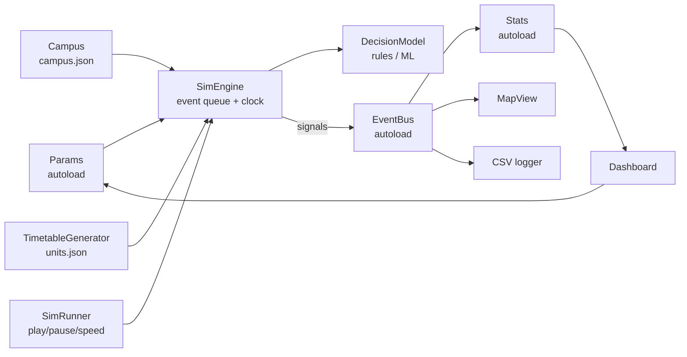
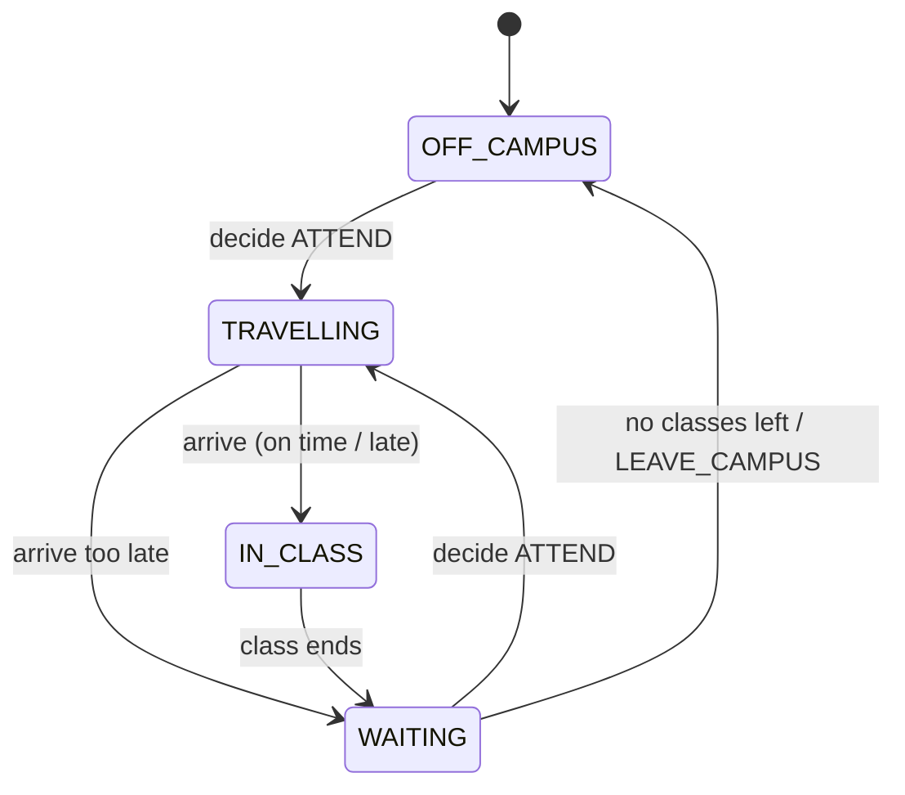

# Architecture

Campus Simulator is a **discrete-event simulation**. Nothing moves on a fixed tick. Instead, a queue of timed events (a class starts, a student decides, a student arrives) moves the clock forward. The visuals watch the simulation, but they never drive it.

## Layers


```mermaid
flowchart LR
    P[Params<br/>autoload] --> E[SimEngine<br/>event queue + clock]
    C[Campus<br/>campus.json] --> E
    T[TimetableGenerator<br/>units.json] --> E
    E --> D[DecisionModel<br/>rules / ML]
    E -- signals --> B[EventBus<br/>autoload]
    B --> S[Stats<br/>autoload]
    B --> M[MapView]
    B --> L[CSV logger]
    S --> UI[Dashboard]
    UI --> P
    R[SimRunner<br/>play/pause/speed] --> E
```

| Layer | Files | Depends on | Must not depend on |
| --- | --- | --- | --- |
| Config | `autoload/Params.gd` | nothing | anything else |
| Core simulation | `sim/**/*.gd`, `decisions/*.gd` | Params, EventBus | Nodes, scenes, UI |
| Signals | `autoload/EventBus.gd` | core types | UI |
| Aggregation | `autoload/Stats.gd`, loggers | EventBus | UI |
| Real-time driver | `sim/core/SimRunner.gd` | SimEngine, Params | UI |
| Presentation | `scenes/`, `ui/` | EventBus, Stats, Params, SimRunner | SimEngine internals |

**Why this matters:** the core runs with no window. That lets us run unit tests, run 5,000 students at full speed to log training data, and replace the visuals later without touching the rules.

## Folder layout

Code is grouped by what it models, so each area has one owner (see `ROADMAP.md`) and a new file has an obvious home. Folders marked *planned* don't exist yet; create them with the first file that belongs there.

```
autoload/          Params (settings), EventBus (signals), Stats (running totals)
sim/
  core/            SimEngine, EventQueue, SimEvent, SimTime, SimRunner, FixedSettings
                   planned: Calendar (weeks, semesters, breaks, exams)
  campus/          Campus (graph + Dijkstra)
                   planned: FoodOutlet, path closures
  timetable/       TimetableGenerator, ClassSession, Assessment, AssessmentPlanner
  students/        Student, StateEffects (the determinants table), Grades
  errands/         planned: ErrandPlanner (knapsack + TSP)
  staff/           planned, Semester 2: Staff
  logging/         planned, Semester 2: RunLogger
decisions/         DecisionModel (base), DecisionContext, RuleDecision
                   planned: MLDecision (Semester 2)
ml/                planned, Semester 2: model loaders and JSON model files
scenes/            Main, MapView; planned: ParamPanel, Dashboard, SemesterReport
ui/                planned: chart widgets and panels shared between scenes
data/              campus.json, units.json, scenarios/, osm/
tests/unit/        one test_<thing>.gd per class
tests/helpers/     fakes shared between tests
tools/             Python scripts (not part of the Godot build)
docs/              these documents
```

**Where does a new file go?**

- It models part of the simulated world and has no Node or UI: a subfolder of `sim/`, named after the thing it models.
- It chooses what a student does: `decisions/`.
- It draws something or handles input: `scenes/` (a scene and its root script) or `ui/` (a widget used by more than one scene).
- It's a value a user can tune: `autoload/Params.gd`. It's a signal between systems: `autoload/EventBus.gd`.

Scripts are found by `class_name`, not by path, so moving a script only breaks `.tscn` files that point at it. Move scripts with `git mv`, and move the `.gd.uid` file next to it if you have one.

## Time

- Time is a `float` in **minutes from Monday 00:00** of the simulated week. `SimTime` converts it (`SimTime.at(1, 9, 30)` = Tue 09:30 = `2010.0`).
- Time is continuous: a student can arrive at 10:07.5.
- Today a run covers `Params.days_to_simulate` days (up to 84, one 12-week semester) and ends at midnight after the last one. The timetable is one week long and repeats: at the end of each week every session moves forward a week. The target is a run with no end, reported semester by semester (decision #7).

## Event queue

`EventQueue` is a binary min-heap ordered by `(time, seq)`. `seq` is the order events were scheduled in. That makes ties deterministic, so the same seed always gives the same run.

| Event | Subject | What happens |
| --- | --- | --- |
| `WEEK_END` | week | Assessments due that week are marked; the timetable moves on a week |
| `DAY_START` | day | Near deadlines raise stress; each student schedules a decision for their first class that day |
| `CLASS_START` | session | Signal only (UI, stats) |
| `CLASS_END` | session | Everyone inside becomes WAITING and schedules their next decision |
| `STUDENT_DECIDE` | student | The decision model picks an action; ATTEND leaves right away |
| `STUDENT_ARRIVE` | student | The student is on time, late, or too late to enter. A room over capacity raises their stress |

Planned events: `SEMESTER_START` / `SEMESTER_END` (build the timetable, send the report) and `ERRAND_DONE` (a student finishes a food stop or study block).

## Student flow


```mermaid
stateDiagram-v2
    [*] --> OFF_CAMPUS
    OFF_CAMPUS --> TRAVELLING: decide ATTEND
    WAITING --> TRAVELLING: decide ATTEND
    TRAVELLING --> IN_CLASS: arrive (on time / late)
    TRAVELLING --> WAITING: arrive too late
    IN_CLASS --> WAITING: class ends
    WAITING --> OFF_CAMPUS: no classes left / LEAVE_CAMPUS
```

Planned: an `ON_ERRAND` activity between `WAITING` and `TRAVELLING`, for food stops and study in free time.

### The core rules (SimEngine)

1. **When to decide.** For the next class, `decide_at = max(now, class.start − travel − LEAVE_EARLY_MINUTES)`. Students aim to arrive a few minutes early. This and the two lateness limits below are in `FixedSettings`.
2. **Travel.** `travel = campus.travel_minutes(from, to)` = shortest-path distance ÷ walking speed (× crowding later). If `decide_at` is already past, the student leaves now. **This is how back-to-back classes in far-apart buildings cause lateness.**
3. **On arrival.** `minutes_late = max(0, arrive − start)`.
   - `minutes_late > TOO_LATE_MINUTES`, or the class has already ended → too late: counts as a skip (`too_late`).
   - `minutes_late > LATE_AFTER_MINUTES` → attended but late.
   - otherwise → attended on time.
4. **Decisions** decide *what* (attend, skip, leave campus). The engine decides *when* and *how long*.
5. **Going home.** When a student has no classes left today, they go to the entrance and become OFF_CAMPUS.

## Student model

Each student has three states: grades, stress and energy. Parameters change what students do and experience (the determinants), and the determinants move the states. The states never feed each other, but low energy can change a student's choices. Satisfaction and stress-triggered skipping are Good to have since 2026-10-02 (decisions #19 and #20) and are not in the code. The full design, with the determinants table, is in [STUDENT_MODEL.md](STUDENT_MODEL.md).

In the code, `StateEffects` holds the determinants table and is the only place that changes stress and energy. The engine calls `StateEffects.apply()` when a student sits through a class, walks, arrives late, skips, has two classes back to back, sits in a room over capacity, or has a deadline within 7 days. Each morning energy is restored, then the commute and an early first class take some of it away. Rows for systems that aren't built yet (study, food stops, breaks) are in the table but nothing triggers them.

`AssessmentPlanner` gives each unit its assessments from two parameters. At the end of each week the engine marks the assessments due that week: `Grades.mark()` compares the hours a student has put into the unit with the hours expected by then. `Student.grade()` is the grades state.

## Algorithms we write ourselves

Pathing, scheduling and walking distance are coded by us, so we don't use Godot's `AStar2D`, `NavigationServer` or `NavigationAgent`.

| Algorithm | Where it appears in the sim | Status |
| --- | --- | --- |
| Shortest path (Dijkstra) | Walking from one class to the next. Run from each building on load and stored as a lookup table. Rerun when a path is closed | Built (`sim/campus/Campus.gd`); closures to build |
| Scheduling | Building the timetable: no room double-bookings, no student clashes. Greedy with random order, largest units first | Built (`sim/timetable/TimetableGenerator.gd`) |
| Knapsack | Fitting classes into rooms by capacity | To build, in the timetable generator |
| Knapsack | Choosing which errands (food, study) fit in a student's free time before the next class | To build (`sim/errands/ErrandPlanner.gd`) |
| Knapsack | Choosing units that fit a student's workload limit | Good to have |
| Travelling salesman | Ordering a student's errand stops for the shortest walk that ends at the next class. Held-Karp (exact) for up to about 10 stops | To build (`sim/errands/ErrandPlanner.gd`) |
| Congestion | Busy paths slow everyone down. A fixed formula, with its strength taken from published pedestrian data | Good to have |

Walking between classes on its own is **not** a travelling salesman problem, because the timetable already fixes the order. The TSP appears when the student chooses the order, which is the errands case.

**3D later:** the campus is stored as a graph (points joined by walking distances). Floors, stairs and lifts become extra points and links, so the algorithms above don't change.

## Decision models

```gdscript
class_name DecisionModel
enum Action { ATTEND_NEXT, SKIP_NEXT, LEAVE_CAMPUS }
func decide(student: Student, context: DecisionContext, rng: RandomNumberGenerator) -> Action
```

- `DecisionModel` (base) = always attend. It's the baseline for tests and experiments.
- `RuleDecision` = the skip chance rises with the square of the energy a student has lost and reaches 1 at zero energy. Stress does not change it. A tired student who has already been to class today leaves campus instead of skipping one class. The app uses this model. Choosing what to do in free time (study, food) comes with the errand planner.
- `MLDecision` (Semester 2) loads a model from JSON (see DATA_FORMATS.md) and runs it in GDScript.
- Models must use the `rng` they are given for all randomness. Never use `randf()` or `randi()`.
- `DecisionContext.to_features()` is the feature vector. The same dictionary is emitted on `EventBus.student_decided` for logging, so training data and runtime features always match.

## Signals (EventBus)

The engine emits these signals and never calls UI code. See `autoload/EventBus.gd` for signatures.

`run_started`, `run_finished`, `sim_time_changed`, `day_started`, `week_ended`, `class_started`, `class_ended`, `student_state_changed`, `student_departed`, `student_arrived`, `student_attended`, `student_skipped`, `student_decided`.

Adding a signal: add it to EventBus with typed arguments and a `##` comment, emit it from the engine, and list it here.

## Parameters

`Params` holds every parameter a user can adjust as a typed variable, plus a `SPECS` entry (min, max, step, label, group). The parameter panel should be built from `SPECS`, so a new parameter shows up in the UI automatically. Values are read at the start of each run: the user changes values and presses Reset.

The agreed list is the 15 in [PARAMETERS.md](PARAMETERS.md). `Params.gd` holds the ones that already have an effect; the rest are added with the system that reads them. Values that are not experiment levers (walking speed, the lateness limits) are named constants in `sim/core/FixedSettings.gd`.

## Outputs

| Output | Where | Status |
| --- | --- | --- |
| End-of-semester report: average grades, stress and energy; peak stress | Semester report screen | To build |
| Attendance rate (overall, by unit, by day), skips by reason | `Stats`, dashboard | In `Stats` |
| Late arrivals, average minutes late, too late to enter | `Stats`, dashboard | In `Stats` |
| Walking time between back-to-back classes | Dashboard | To build |
| Room use, students turned away | Dashboard | To build |
| Food outlet queue length and wait | Dashboard | To build |
| Students per path at each hour | Dashboard | To build |

## Performance targets

- 5,000 students × 5 days runs to the end in a few seconds headless.
- Draw students with one `MultiMeshInstance2D`, not one Node per student.
- `Campus` pre-computes all building-to-building distances once (Dijkstra from each building) so `travel_minutes` is a lookup.
- The dashboard refreshes on `sim_time_changed` (once per frame), not per event.
- Keep one summary per semester, not every event, so long runs don't keep growing.

## Components

First versions of the campus, timetable and map were built together so the whole loop runs end to end. The roadmap owners take these over and improve them.

| Component | File | Status | Contract |
| --- | --- | --- | --- |
| Campus loader + pathfinding | `sim/campus/Campus.gd` | First version (Hayyaan to take over) | Loads campus.json; Dijkstra from every building on load, so `distance_m()`, `path_between()` and `path_points()` are lookups. Keep the public API |
| Campus data | `data/campus.json`, `tools/build_campus_from_osm.py` | First version (Shuyu to take over) | Monash University Malaysia from OpenStreetMap; rooms are placeholders; no food outlets yet |
| Timetable generator | `sim/timetable/TimetableGenerator.gd` | First version (Hayyaan to take over) | `generate(campus, units, rng) -> {"sessions", "students"}` using Params. No room double-booking; no student clashes; classes start on the hour and end `slot_gap_minutes` early; repeat lecture streams for clashing students |
| Map view | `scenes/MapView.gd` | First version (Siw to take over) | Listens to EventBus; draws buildings, paths and students (one MultiMesh); walkers follow `Campus.path_points()` |
| Main scene + temporary HUD | `scenes/Main.gd` | Temporary | Builds a run; the HUD is replaced by ParamPanel and Dashboard |
| Student states | `sim/students/Student.gd`, `sim/students/StateEffects.gd` | Built | See STUDENT_MODEL.md. `StateEffects` is the only place that changes stress and energy; every size has a source or a stated assumption |
| Rule decisions | `decisions/RuleDecision.gd` | Built | Extends DecisionModel. `skip_chance(student)` from energy |
| Calendar | `sim/core/Calendar.gd` | To build | Mid-semester break, exam period, break between semesters, semester after semester. The engine already repeats the weekly timetable for one semester |
| Assessments and grades | `sim/timetable/Assessment.gd`, `sim/timetable/AssessmentPlanner.gd`, `sim/students/Grades.gd` | Built | `AssessmentPlanner.plan(unit_codes)` gives a due week and weight per assessment; the mark comes from hours put in against hours expected |
| Errands | `sim/errands/ErrandPlanner.gd`, `sim/campus/FoodOutlet.gd` | To build | Knapsack picks the stops that fit the free time; TSP orders them |
| Parameter panel | `scenes/ParamPanel.tscn` | To build | Built from `Params.SPECS`; see PARAMETERS.md |
| Dashboard | `scenes/Dashboard.tscn` | To build | Reads `Stats`; see Outputs above |
| Semester report | `scenes/SemesterReport.tscn` | To build | Shown on `semester_ended`; the three state averages |
| Staff, recordings, friend groups | `sim/staff/` and others | Semester 2 | The four Good parameters in PARAMETERS.md |
| CSV logger | `sim/logging/RunLogger.gd` | Semester 2 | Listens to `student_decided` / outcomes; writes to `user://logs/` |
| ML decisions | `decisions/MLDecision.gd`, `ml/` | Semester 2 | See DATA_FORMATS.md, model JSON |
