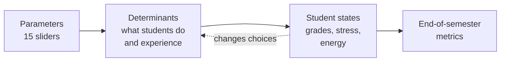

# Parameters

**Status: 15 parameters for v1** (decision #10 in `DECISIONS.md`): 11 Must for Semester 1 and 4 Good for Semester 2. One Must parameter, Resilience, is parked after the 2026-10-02 supervisor meeting (see the note under the table), which leaves 10 in use. This replaces the earlier list of 44. Don't add a parameter without a justification and a check with the team.

Parameters marked ✓ are already in `autoload/Params.gd`. Every default is a starting value. Arya checks it against a source before it goes into `Params.gd`.

## How parameters reach the results

A parameter never changes a result directly. It changes what students do and experience (the **determinants**), the determinants move three **student states** (grades, stress, energy), and the averages of those states are the end-of-semester metrics. The full model is in [STUDENT_MODEL.md](STUDENT_MODEL.md).

**The test for a parameter:** it must reach at least one metric through a row of the determinants table. If it doesn't, either a row is missing or the parameter isn't earning its place.

## Must have (11)

| # | Parameter | Range | Default | In code as | Why we have it |
| --- | --- | --- | --- | --- | --- |
| | **Students** | | | | |
| 1 | ✓ Students | 50–5000 | 500 | `student_count` | Enrolment numbers. Drives crowding in rooms and queues |
| 2 | ✓ Units per student | 1–6 | 4 | `units_per_student` | Subjects decide where students go. More units means more class hours and deadlines |
| 3 | ✓ Average commute | 5–120 min | 45 | `average_commute_minutes` | Long commutes mean waking earlier and arriving tired. Half of the "8am effect" |
| 4 | Resilience (**parked**) | 0–100 | 70 | | How much stress a student can take before burning out. Each student gets their own value around this average, so they don't all burn out at once |
| | **Timetable** | | | | |
| 5 | ✓ Teaching day (start and end) | 6–12 / 14–22 (hour) | 8 / 18 | `day_start_hour`, `day_end_hour` | Early starts and long days drain energy. The other half of the "8am effect" |
| 6 | ✓ Class length (lecture and tutorial) | 30–180 min | 120 / 60 | `lecture_minutes`, `tutorial_minutes` | Longer sessions drain more energy |
| 7 | ✓ Gap between slots | 0–30 min | 10 | `slot_gap_minutes` | Changeover time to walk between classes. Too short and students arrive late |
| | **Campus** | | | | |
| 8 | ✓ Room capacity | 0.5–1.5 × | 1.0 | `room_capacity_multiplier` | Overfull rooms turn students away |
| 9 | Food outlets (open) | 1–10 | 4 | | Stops students visit in their free time (knapsack and TSP). A stop raises energy and lowers stress, the same at every outlet. Fewer outlets means longer queues, which use up free time. Sets how many of the outlets in the map data are open |
| | **Semester** | | | | |
| 10 | ✓ Assessments per unit | 1–6 | 3 | `assessments_per_unit` | How many deadlines students face |
| 11 | ✓ Deadline clustering | 0–1 | 0.5 | `deadline_clustering` | When the deadlines hit (0 = spread out, 1 = all in the same weeks). Clustered deadlines cause stress peaks |

Teaching day and Class length each count as one parameter with two settings.

**Resilience is parked.** Stress no longer makes a student skip in v1 (decision #20), so Resilience moves no metric and fails the test above. It has been taken out of `Params.gd`, because a slider that does nothing would mislead (proposed, decision #23). The team can bring it back with burnout, or give it another job.

## Good to have (4)

| # | Parameter | Range | Default | Why we have it | Needs |
| --- | --- | --- | --- | --- | --- |
| 12 | Lecture recordings (% of units fully recorded) | 0–100% | 0% | Recorded units are otherwise identical to unrecorded ones, so the two can be compared fairly. Watching a recording counts as part of an hour of class | Units flagged as recorded |
| 13 | Staff reliability (absence rate and punctuality) | 0–10% / 0–15 min | 2% / 5 | Cancelled or late classes waste student trips | Lecturers and tutors as agents |
| 14 | Tutors per unit | 1–10 | 3 | Limits how many tutorial groups a unit can run, so fewer tutors means bigger tutorials | Lecturers and tutors as agents |
| 15 | Friend influence | 0–1 | 0.3 | Skipping spreads through friend groups (friends = students who share units) | A friend network |

## Controls (not counted as parameters)

These don't describe the simulated world.

| Control | Where | Default | In code as | Notes |
| --- | --- | --- | --- | --- |
| ✓ Sim speed | Toolbar | 5 sim min/s | `sim_minutes_per_second` | Playback only. The same seed and settings give the same result at any speed |
| ✓ Seed | Toolbar | 42 | `random_seed` | Same seed and same settings give the same run, so experiments can be repeated |
| Calendar preset | Toolbar | Standard | | Standard (2 × 12 teaching weeks) or Trimester (3 × 10). Sets teaching weeks, semesters per year, the mid-semester break, the exam period and the break between semesters |
| Path closures | Click a path on the map | none | | Shows the pathfinding live: close a path and students reroute |
| Stop after N semesters | Headless runs only | 0 (never) | `days_to_simulate` for now | Test and data-logging runs need an end point. The normal app never stops |

## Fixed settings (not sliders)

The sim needs these, but they aren't experiment levers. Each becomes a named constant with its source in a comment.

| Setting | Value | In code as |
| --- | --- | --- |
| Walking speed | 80 m/min. A small spread per student is still to add | `FixedSettings.WALKING_SPEED_M_PER_MIN` |
| Leave early by | 5 min | `FixedSettings.LEAVE_EARLY_MINUTES` |
| Late after | 5 min | `FixedSettings.LATE_AFTER_MINUTES` |
| Too late to enter | 20 min | `FixedSettings.TOO_LATE_MINUTES` |
| Early start | A first class before 09:00 counts as early | `FixedSettings.EARLY_START_REFERENCE_HOUR` |
| Commute spread | Each student's commute is 50% to 150% of the average | `FixedSettings.COMMUTE_SPREAD` |
| Units offered | Every unit in `data/units.json` | |
| Course length | 3 years | |
| New intake per year | Starting students ÷ course length, so the population stays level | |
| Crowding strength | From published pedestrian data. Used from Semester 2 | |
| Path capacity | From the map data | |
| Hours expected per unit | 6 a week on campus: half of Monash's 12 for a 6-point unit. Grades are measured against it | `FixedSettings.EXPECTED_HOURS_PER_UNIT_WEEK` |
| Teaching weeks | 12 | `FixedSettings.TEACHING_WEEKS` |
| Deadline is near | The 7 days before it is due | `FixedSettings.DEADLINE_NEAR_DAYS` |
| Effect sizes | One fixed number per arrow of the determinants table, each with a unit and a source or stated assumption. See "Effect sizes" in [STUDENT_MODEL.md](STUDENT_MODEL.md) | `StateEffects.EFFECTS` |

## Dropped for v1

These were in the list of 44. Most were scope creep or overlapped with something kept. They can come back after v1.

| Dropped | Why |
| --- | --- |
| Base attendance chance | Attendance now comes from energy (`RuleDecision`), not a set probability. Removed from `Params.gd` |
| Units, Commuters by public transport, Leave early by, Stress per deadline, Fatigue per class hour, Walking speed, Walking speed spread, Crowding strength, New intake per year, Course length | Folded into the parameters above or turned into fixed settings |
| Library seats, Part-time work | Each needs its own system and no kept parameter depends on it |
| Max teaching hours | Staff are Good to have, and Staff reliability covers the student-facing effect |
| Summer intensive calendar preset | Not a whole-year calendar |
| Motivation (average), Burnout threshold | Dropped on 2026-09-29. Resilience is each student's burnout point |

## What this needs in the code

Owners and order are in `ROADMAP.md`.

- **`Params.SPECS` now holds the agreed parameters that have an effect**, plus the run controls. The fixed settings moved to `sim/core/FixedSettings.gd`. One Must parameter is not in `Params` yet, because a slider that does nothing would mislead: Food outlets waits for the errand planner. Add it with the system that reads it.
- **Student states and determinants:** the states, effects table, skip rule, assessments and grades are built. See "In the code" in [STUDENT_MODEL.md](STUDENT_MODEL.md) for what is left.
- **No end time:** `SimEngine` has an `end_time` and stops after `days_to_simulate` days (up to 84, one semester; the weekly timetable repeats). The app version runs with no end; only headless runs use "Stop after N semesters".
- **Schedule as you go:** `SimEngine.setup()` queues every class event at the start. An endless run can't do that, so a `WEEK_START` event queues that week's classes, and a `SEMESTER_START` / `SEMESTER_END` pair builds the timetable and sends the report.
- **Calendar:** add week and semester numbers to `SimTime`. Time stays as float minutes: GDScript floats are 64-bit, so years of minutes keep full precision.
- **Food outlets:** the map data has no outlets yet. Add them to `campus.json` with a service time and a queue, and document the format in `DATA_FORMATS.md` in the same change.
- **Parameters are set once per run** (decision #17). `Params` is read when a run starts and doesn't change while it plays. To try different settings, change them and press Reset to start a new run. Path closures are the one live control: they can be clicked while the sim runs.
- **Adding a parameter:** a typed var plus a `SPECS` entry in `Params.gd`, the value in `data/scenarios/default.json`, a row in this file with its justification, and a source for the default.
